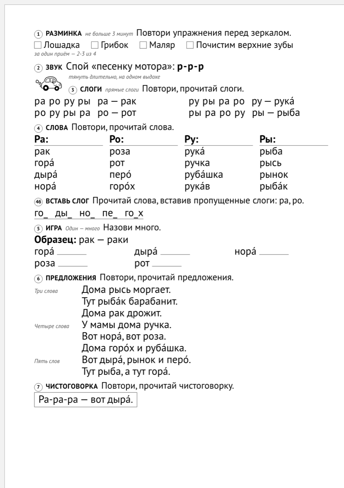
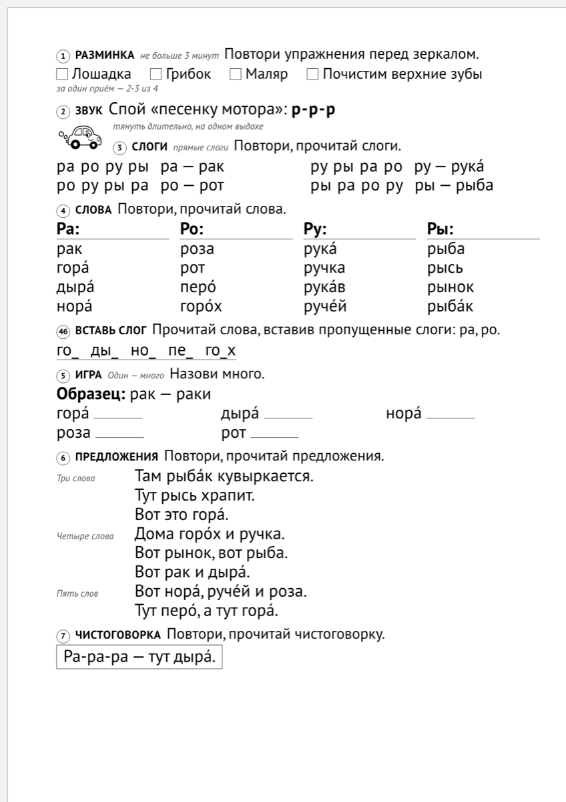

# Текст о сервисе — ЧИСТОВИК. Прозу здесь пишет автор

> **Дом одного текста** (ШАГ 2 канона Site Builders). Раньше твои абзацы жили внутри
> `research/site/shag2_material_i_chernoviki_2026-08-24.md` вперемешку с моими черновиками —
> там их нельзя было отличить от моих. Отсюда текст потом нарежется на страницы сайта.
>
> **Закон этого файла:** прозу пишет ТОЛЬКО автор. Клод кладёт сюда данные (замеры, таблицы),
> иллюстрации и пометки `⚠` — и ни одного предложения текста.
>
> Бриф-каркас — `research/site/shag2_tekst_skelet_2026-08-23.md`
> Сырьё с тирами и мои черновики — `research/site/shag2_material_i_chernoviki_2026-08-24.md`
>
> **Объём на 08-24: 2 672 знака** (канон: 2 000–4 500). П. 4 не написан — с ним будет ≈3 100.

---

## 1. Что это такое · ~250 знаков · написано (199)

Логозвук собирает печатный лист на автоматизацию звука. Выбираете звук, отмечаете, каких звуков у ребёнка ещё нет — и получаете готовый А4. Сейчас работают одиннадцать звуков и шесть видов материала.

> ⚠ «шесть видов материала» — ✅ верно по экрану: вкладок ровно шесть (Занятие · Звуковая дорожка ·
> Слоговая дорожка · Словосочетания · Лабиринт · Рассказы). В STATE стоит «семь» — там отдельно
> считаются два листа рассказов (пересказ и «сочини сам»), которые на экране одна вкладка.

---

## 2. Какую проблему решает · ~400 знаков · написано (467)

В циклограмме логопеда детского сада есть строка «Изготовление пособий» — час каждый день.

Время уходит на то, чтобы найти материал на нужный звук и "подогнать" его под ребёнка. Подгонять приходится всегда. Альбом на звук [Р] рассчитан на ребёнка, у которого всё остальное уже стоит, — а часто на приём приходят дети с дизартрией и ОНР, где нарушено полсписка. В слове «рубашка» есть [ш], в «дыре» — [д]. Ребёнку, у которого этих звуков нет, такое слово не помогает, а мешает.

**[скрин]** обычный лист на [Р] — `web/img/list-r.png`

---

## 3. Как это работает · ~500 знаков · написано (531)

Три шага.

1. Выбираете звук
2. Отмечаете, какие ещё звуки у ребёнка не поставлены
3. Печатаете

Что происходит на втором шаге.

Например, выбрали звук [Р]. В картотеке звука [Р] 168 слов. Девять уходят сразу и без вопросов — это слова с [Л], его путают с [Р] почти всегда. Остаётся 159.

Отметили, что не поставлены [Ш] и [Ж], — остаётся 135. Отметили ещё [С] и [З] — остаётся 105. Полсотни слов, которые ребёнку сейчас не по силам, на лист не попадут, и вам не придётся вычёркивать их карандашом.

Мягкие пары отмечать не нужно: отметили [Л] — уйдёт и [Ль].

> ⚠ **«его путают с [Р] почти всегда» — источника у нас НЕТ.** Что подпёрто:
> ✅ [Р] и [Л] — оппозиционная пара в движке (`phonetics.py`, `OPPOSITION_PAIRS`), слова с [Л]
> на листе [Р] снимаются всегда, без спроса — замер даёт ровно 9 слов из 168;
> ✅ правило чистоты материала (Коноваленко: материал не должен содержать неосвоенных звуков) —
> проверено четырьмя независимыми проходами, `research/logoped_canon_verify_2026-08-01.md`;
> 🔶 а вот **частота смешения** («путают почти всегда») — клиническая цифра, и у нас её нет
> ни одной цитатой. По закону №1 проекта это брак. Два хода: либо ты переписываешь фразу под то,
> что подпёрто (правило чистоты, а не статистика), либо я иду за источником отдельной работой.

> ⚠ **Таблица «сколько слов остаётся» со страницы СНЯТА** (решение автора 08-24): те же числа
> показывает сам экран — на странице стоит фрагмент блока «Из чего собран этот лист»
> (168 → −9 → 159 → −24 → 135). Замер остаётся здесь как проверяемый факт:
> ничего не отмечено — 159 из 168 · [Ш],[Ж] — 135 · [С],[З],[Ш],[Ж] — 105 · плюс [Щ],[Ч],[Ц] — 96.

**[скрин]** тот же лист с профилем — `web/img/list-r-profil.png`

⚠ Два листа глазами различаются слабо (я их сравнивал). Работает число, а не пара картинок.

---

## 4. В каких ситуациях помогает · ~450 знаков · ПРИНЯТО автором 08-24

*(твоя пометка себе, дословно)* [найти из практики логопеда примеры когда такой лист сэкономит время - пример должен быть реальной, из боли логопеда]

> Собран Клодом по просьбе автора 08-24 **только из источников** — ни одного выдуманного случая,
> опора под каждым примером подписана ниже. **Автор прочитал и принял как есть** («оставляем так,
> как ты написал»), зная, что канон просит здесь свои слова. Это отступление названо вслух, а не
> проскочило молча.

**Текст (616 знаков — на 166 больше бюджета, режется легко):**

> **Занятие на двоих.** У одного ребёнка не поставлены [Ш] и [Ж], у второго к ним ещё [С] и [З].
> Отмечаете все четыре — и остаётся материал, который оба произнесут без спотыкания. Один лист
> вместо двух.
>
> **Ребёнок с дизартрией.** Простая дислалия почти не приходит: приходят дизартрия и ОНР, где
> нарушено полсписка. Альбом на [Р] у такого ребёнка наполовину состоит из слов, которые он
> сейчас не выговорит. Здесь их не будет: на этом профиле от 168 слов картотеки остаётся 105.
>
> **Лист домой.** Тот же материал печатается домашним листом — рядом с каждым упражнением
> написано, что делать взрослому, который не логопед.

**Чем подпёрт каждый пример** (`research/logoped_realnye_zaprosy_2026-08-02.md` — 8 настоящих
обращений логопедов к LogoKonspekt):

| пример | опора |
|---|---|
| занятие на двоих | ✅ 3 обращения из 8 — групповые (2 детей); профиль в движке сквозной |
| дизартрия и ОНР | ✅ «ни одного случая простой дислалии»; в обращениях дизартрия ×2, ОНР III, дизартрия+ОНР 5 лет. Число 105 — замер `pool_stats` |
| лист домой | ✅ домашнее задание запрошено в 3 обращениях из 8; подсказки взрослому на домашнем листе — Фомичёва 1989 |

⚠ Чего в источниках НЕТ и чего я не писал: «завтра занятие, а материала под рукой нет» —
правдоподобно, но это догадка, а не наблюдение. Если такое было у тебя или у Ольги — это
и будет четвёртый пример, самый сильный.

**[скрин сюда]** домашний лист с подсказками родителю — `web/img/list-r-doma.png`

---

## 5. Для кого · ~250 знаков · написано (102)

Сервис для логопеда: в детском саду, в частной практике, для дефектолога. Родителю он тоже пригодится.

> ⚠ В столпах записано не-целью: **не диагностика и не замена логопеду**. Пока этого в тексте нет —
> страница обещает больше, чем сервис делает. Место есть: пункт недобрал 148 знаков.

---

## 6. Какие есть материалы · ~700 знаков · написано (722)

Шесть материалов, все на один и тот же звук и один и тот же профиль ребёнка.

**Занятие** — составной лист: гимнастика, изолированный звук, слоги, слова, предложения,
чистоговорка. Один лист закрывает занятие целиком.
**Звуковая дорожка** — ребёнок ведёт пальцем по линии и тянет звук. Три линии — три задачи голосу: тянуть слитно, вести выше и ниже, произносить отрывисто.
**Слоговая дорожка** — слоги по тропе, с фоном.
**Словосочетания** — прилагательное и существительное, оба со звуком.
**Лабиринт** — ход по картинкам, звук в нужной позиции слова.
**Рассказы** — готовый текст для пересказа и лист «сочини сам» по опорным словам.

Картинки свои: 980 рисунков, по одному на каждое слово, которое может попасть в клетку.

> ⚠ **979, не 980** — замер по банку: `pictures/objects_colour/` = 979 файлов, ч/б столько же.
> Вторая половина фразы ✅ проверена сегодня отдельно: собрал 297 клеток лабиринта (11 звуков × 3
> раскладки) — **ни одной клетки без картинки**. В самой картотеке 445 слов без рисунка
> («ветер», «мороз», «хор»), но фильтры узнаваемости их в клетку не пускают.

**[скрины]** по одному на материал (все в `web/img/`, сняты с живого сервера):

| материал | снимок |
|---|---|
| Занятие | `list-r.png` |
| Звуковая дорожка | `zvukovaya-r.png` |
| Слоговая дорожка | `dorozhka-r.png` |
| Словосочетания | `frazy-r.png` |
| Лабиринт | `labirint-r.png` |
| Рассказы | `rasskaz-r.png` |

**Таблица «что в банке» — ВАРИАНТ А, компактный (замер 08-24):**

| в картотеке | сколько |
|---|---|
| звуков | 11 |
| слов-существительных | 1 595 |
| глаголов | 356 |
| прилагательных | 253 |
| текстов для пересказа | 31 |
| своих рисунков | 979 |

**ВАРИАНТ Б, по звукам** — если хочешь показать, что банк не «на один звук для витрины»:

| звук | слов | глаголов | прилагательных |
|---|---|---|---|
| Р | 168 | 48 | 41 |
| Рь | 159 | 39 | 23 |
| Л | 187 | 26 | 28 |
| Ль | 165 | 37 | 29 |
| С | 197 | 34 | 29 |
| Сь | 152 | 24 | 16 |
| З | 128 | 37 | 19 |
| Зь | 81 | 27 | 8 |
| Ш | 166 | 29 | 21 |
| Ж | 87 | 29 | 17 |
| Щ | 105 | 26 | 22 |
| **всего** | **1 595** | **356** | **253** |

⚠ Одна из двух, не обе: одиннадцать строк на лендинге тяжелы, но именно они показывают масштаб.
Выбор твой.

---

## 7. Чем отличается от готовой картотеки · ~450 знаков · написано (388)

У бумажного альбома есть то, чего нет здесь: тексты, выверенные десятилетиями, рисунки
художника, и он не сломается и не «не загрузится». Если у вас есть хороший альбом — он и дальше будет хорошим.

Отличие одно. Альбом напечатан один раз и на всех детей. Здесь материал собирается под того ребёнка, который сидит перед вами: слова со звуками, которых у него ещё нет, на лист не попадают.

**Сравнительная таблица** (переделана 08-24 по разбору автора: строки «надёжность» и «тексты
и рисунки» сняты — по первой мы проигрываем, вторая звучала как «наши тексты хуже», и обе
дублировали абзацы выше):

| | бумажный альбом | Логозвук |
|---|---|---|
| подбор под ребёнка | один материал на всех детей | слова со звуками, которых у ребёнка нет, на лист не попадают |
| сколько звуков | отдельное издание на каждый звук | одиннадцать звуков в одном месте |
| второе занятие на тот же звук | те же страницы | кнопка — и набор слов другой |
| сколько стоит | покупается | бесплатно |

✅ «отдельное издание на каждый звук» — комплект «Альбом дошкольника» ГНОМ 2007–2008: десять
альбомов, по одному на звук (`research/logoped_metodbaza_2026-08-01.md`).
✅ «кнопка — и набор слов другой» — замер 08-24: лист №1 даёт «рак · роза · рука», №2 — «баран ·
мороз · рубашка», №3 — «жираф · пирог · рынок». Кнопка в виджете есть (кубик «Собрать другой
набор слов»).
⚠ Что у бумаги лучше, сказано в абзаце выше — таблица это не отменяет.

⚠ Правовое (`CLAUDE.md`): фамилии авторов пособий в тексте не называть — только «бумажные альбомы».

---

## 8. Сколько стоит · ~100 знаков · написано (27)

Бесплатно. Регистрации нет.

---

> ⚠ **Слово «профиль» на страницу не выносим** (проверка 08-24). У логопедов «профиль» — это
> **артикуляционный профиль**: схема органов артикуляции в разрезе, стандартное учебное пособие.
> То, что мы внутри зовём «профилем ребёнка», в речевой карте называется просто **нарушенные
> звуки**. В самом виджете этого слова и нет — там написано «Какие ещё звуки у ребёнка не
> получаются?». В подписях макета «без профиля» заменено на «ничего не отмечено».
> ⚠ Следствие, которое решать тебе: у страницы в реестре стоит адрес `profil-rebenka`
> (`web/sitepages.py`). Заголовок у неё уже правильный — «Как убрать из речевого материала
> непоставленные звуки», а вот адрес несёт наше слово.

## 9. С чем работает · ~150 знаков · написано (129)

Обычный А4, чёрно-белый принтер подойдёт — цветной лист есть отдельной кнопкой.
Работает в браузере на телефоне и на компьютере.

> ⚠ **Что значит раздел.** В каноне он звучит «с какими форматами работает» и написан под софт,
> который что-то принимает и что-то отдаёт (PDF-редактор: какие файлы съест, во что сохранит).
> Читать его надо как **«что нужно иметь, чтобы это заработало, и что получится на выходе»** —
> человек проверяет, подойдёт ли ему сервис, не запуская его.
> Наши ✅ факты для этого пункта: 11 звуков · браузер на телефоне и компьютере · ничего
> устанавливать не надо · выход — лист А4 · печать на чёрно-белом принтере, цветной отдельной
> кнопкой · **лист скачивается настоящим PDF** (это с 08-24, в твоём абзаце пока не сказано).

---

## 10. Что в планах · ~250 знаков · написано (107)

Впереди:
три вида заданий — «четвёртый лишний», зашумлённые картинки и обводка.
Ручная проверка материалов.

> ⚠ Сроков не называть — это правило из брифа, оно у тебя соблюдено.

---

## Что канон требует, а в тексте пока нет

1. **Порядок.** Зуев на разборе прямо поднимает «чем лучше конкурентов» ВЫШЕ: «очень часто люди
   приходят на сайт из-за того, что им не подошло что-то у другого». Наш п. 7 стоит седьмым —
   по канону ему место сразу после «как это работает».
2. **Ссылки на свой проект: 1–3 штуки**, «в начале, в середине и в конце, там, где они нормально
   просятся, а не вымученно». Сейчас ноль.
3. **Суть — в первых двух предложениях**: человек может дальше не читать. П. 1 это делает ✅.
4. **Скрины.** Восемь снимков сняты и лежат в `web/img/`, в тексте не расставлены ни разу.
   «Скриншотов не бывает много» — дословно.
5. **П. 4 не написан** — самый дешёвый способ добрать объём и самый сильный по канону.

## Куда это потом уйдёт

Главная (пп. 1–3, 5, 8) · страница звука Р (пп. 2–4, 6) · «профиль ребёнка» (п. 3 подробно) ·
«чем отличается от картотеки» (п. 7). Нарезаем ПОСЛЕ того, как текст готов целиком.
